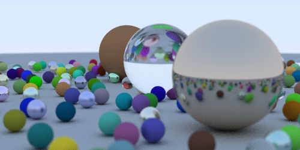

# Ray Tracing In One Weekend

From the book by Peter Shirley, [available for free on Github](https://github.com/RayTracing/raytracing.github.io/blob/master/books/README-InOneWeekend.md). Extra credit to [scratchapixel](https://www.scratchapixel.com) for the in-depth explanations for the trickier topics, in particular [refraction of dielectric materials](https://www.scratchapixel.com/lessons/3d-basic-rendering/introduction-to-shading/reflection-refraction-fresnel).

